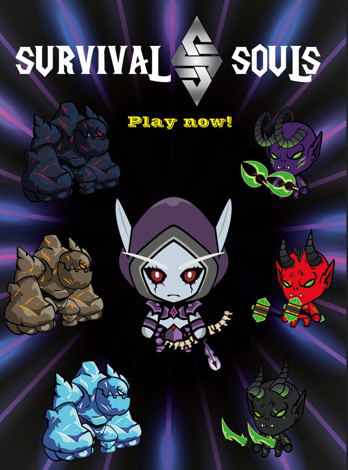
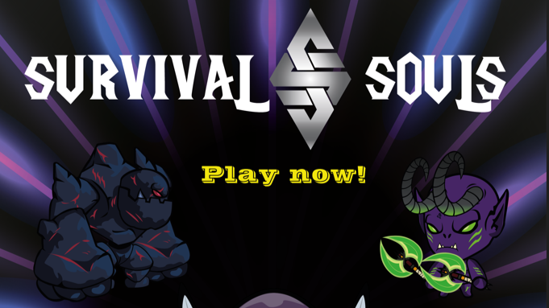

# Survival-Souls

Your soul is fading!

Survive as long as possible on this survival, roguelite game.

Upgrade your character with each failure, and you might gather the power to challenge the legendary Soul Trials!

## Gameplay/Trailer

## Installation
Download "Survival-Souls_1.0.rar" from this repositroy, unzip it, and run the "Survival-Souls.exe" file.

You can also download it from [itch.io](https://lgf-streetlight.itch.io/survival-souls)

## Concepts developed in this project:
- Develop a video game in unity from scratch.
- Work in a multi-disciplinary team (3 programmers and 1 artist).
- Carry out all the stages of the development of a video game: Idea, Planning, Pre-Production, Production, Testing, Release and Post-Production.
- Making a videogame with our own art and a characteristic visual aspect, without overusing external assets.
- Develop merchandising for the final launch of the game.

## Possible future improvements:
- Add more variety of weapons, enemies and special abilities.
- Implement an online ranking system.
- Improve the progression system for unlockables.
- More testing and bug fixing.
